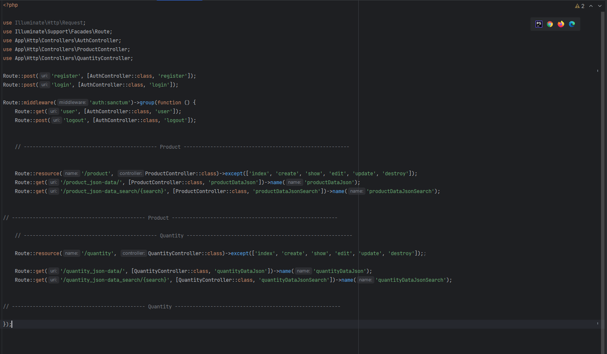
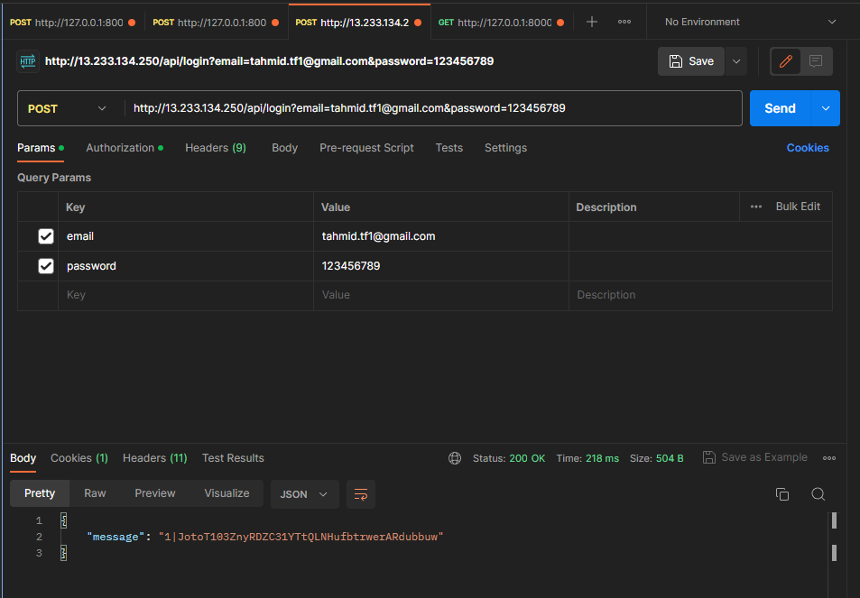
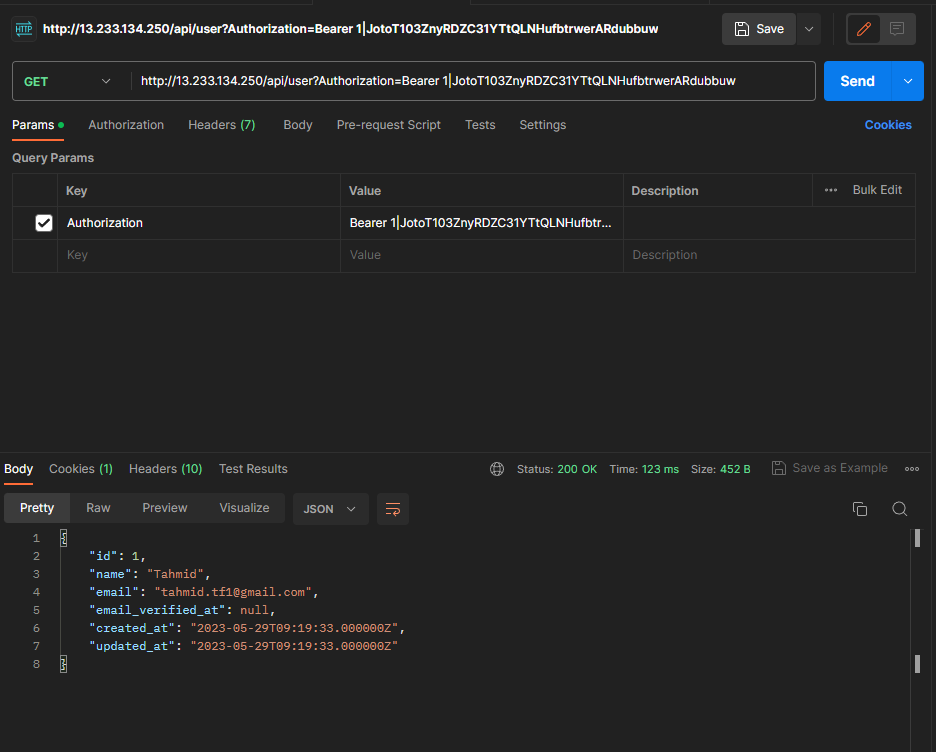
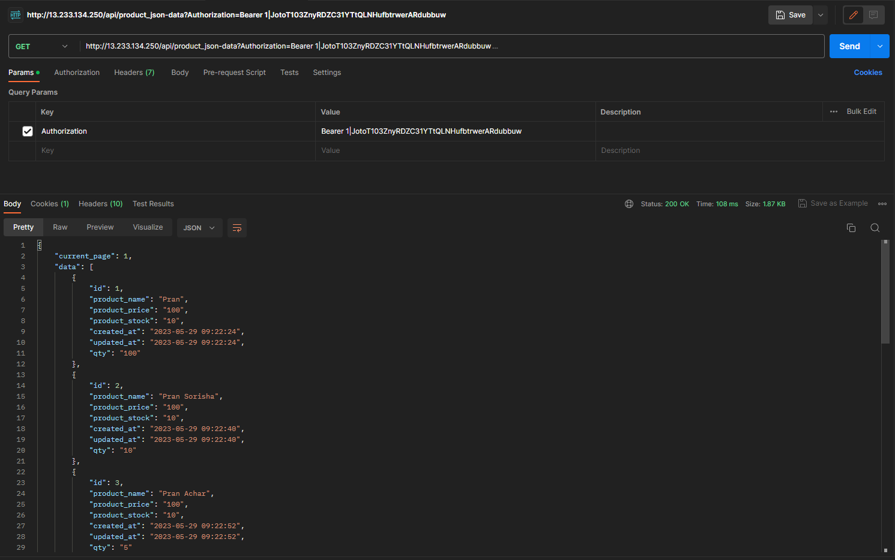
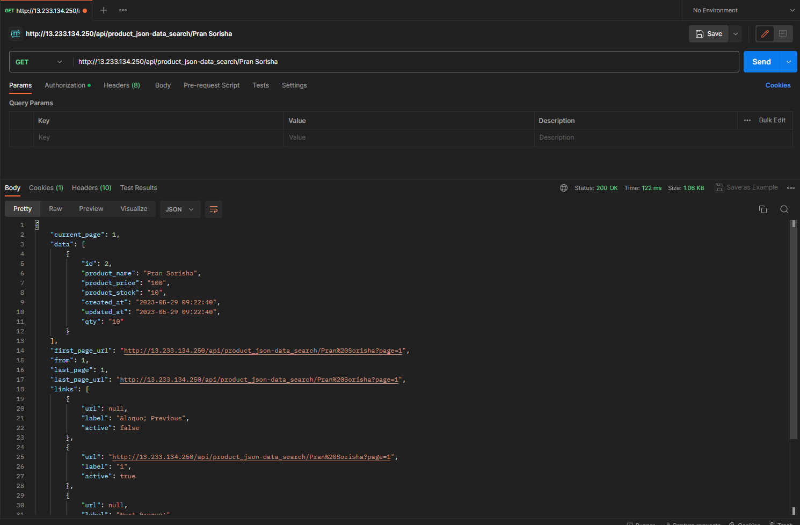
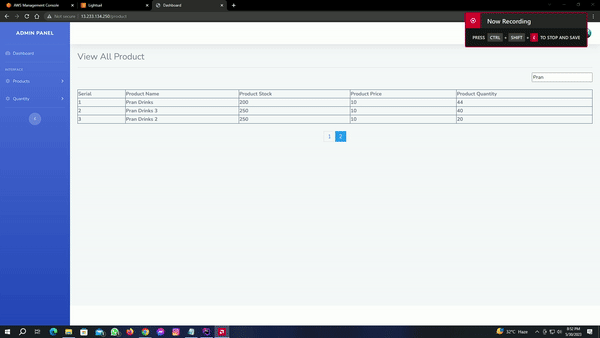
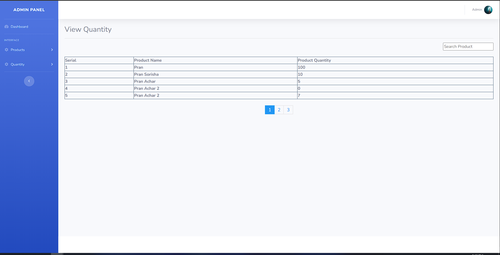

<h3>Sokiro Technologies Limited - Assignment</h3>

>
url: <a href="http://13.233.134.250/">http://13.233.134.250/</a>

>
Login Credentials

>
Email : tahmid.tf1@gmail.com

>
Password : 123456789

>Web routes can be found from routes->web.php  
>API routes can be found from routes->api.php   
>The SQL is file is provided, it is named as "sokiro.sql"

<h3>API Routes [ With Sanctum Authentication ]</h3>

>

<h3>API Testing from postman</h3>

>Login as User

>Retrieving User Data

>Product Data with pagination

>Product Data Search with pagination

>Product data search frontend [ GIF Format ]

>Quantity data search frontend [ Image Format ]

